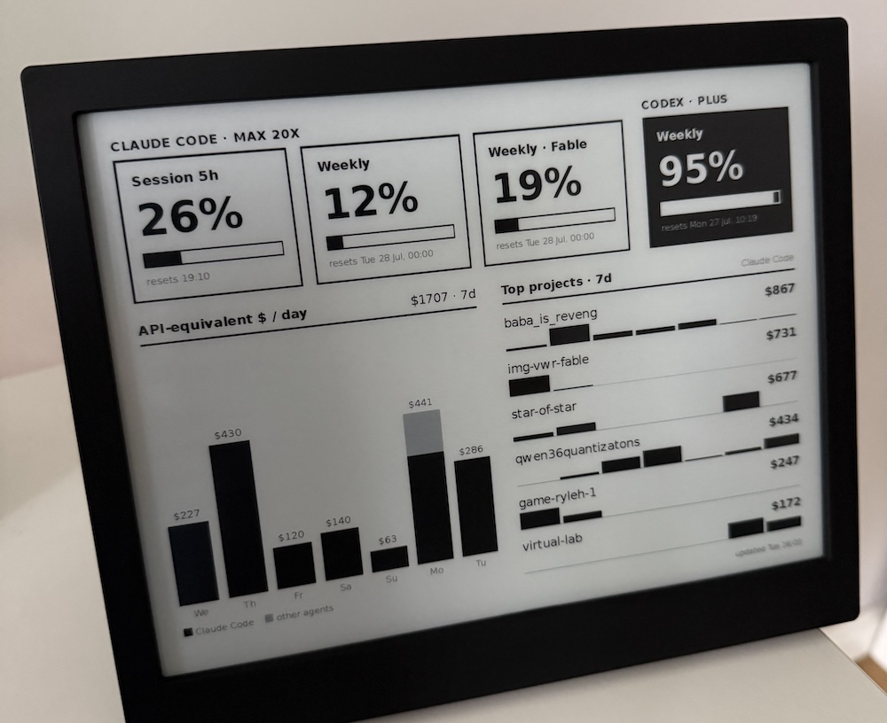

# TRMNL X — Claude Code + Codex usage screen

An e-ink dashboard for a [TRMNL](https://trmnl.com) private plugin: rate
limits for Claude Code and Codex, API-equivalent $ per day per agent, and
your top projects — pushed from your Mac every 10 minutes.



Data sources (no servers, everything reads local state):

- **Claude limits + plan** — undocumented `api.anthropic.com/api/oauth/usage`
  endpoint, OAuth token from the macOS Keychain. Unofficial; rate-limited, so
  don't poll faster than ~10 min.
- **Codex limits** — `codex app-server` JSON-RPC; the CLI handles auth.
- **$ / day and top projects** — [ccusage](https://ccusage.com) via
  `pnpm dlx`, plus `~/.claude/projects/` JSONLs for project names and
  per-day sparklines.

## Setup

1. On trmnl.com create a **Private Plugin** with strategy **Webhook**; copy
   its URL.
2. `cp config.json.example config.json`, paste the URL (`config.json` is
   gitignored — the UUID lets anyone push to your screen).
3. Paste `template.liquid` into the plugin's Markup editor.
4. Test: `uv run --no-project push_usage.py --dry-run`, then without the flag.
5. Install the schedule (edit paths in the plist to match your machine):

   ```sh
   cp com.pmigdal.trmnl-usage.plist ~/Library/LaunchAgents/
   launchctl bootstrap gui/$(id -u) ~/Library/LaunchAgents/com.pmigdal.trmnl-usage.plist
   ```

Logs: `/tmp/trmnl-usage.log`. Fetch failures also render as a warning strip
on the device and exit non-zero.

## Config (`config.json`)

| key | default | |
|---|---|---|
| `webhook_url` | — | required (or `TRMNL_WEBHOOK_URL` env var) |
| `cost_days` | 7 | days in the cost chart and sparklines |
| `top_projects` | 6 | project rows |
| `chart_max_px` | 230 | tallest chart bar, px |

## Notes

- The template targets TRMNL X's logical viewport (~936×702 @ 2× density);
  tiles at ≥90% usage invert to black.
- TRMNL webhook caps: 12 pushes/hour, 2 KB payload.
- The screen goes stale while the Mac sleeps — see the "updated" stamp.

MIT © Piotr Migdał
